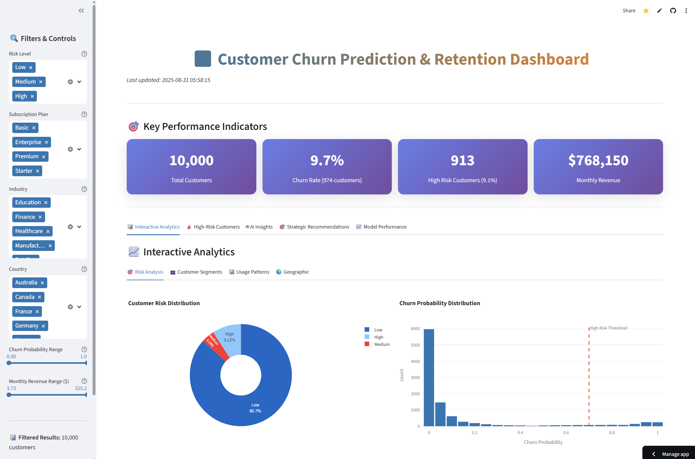
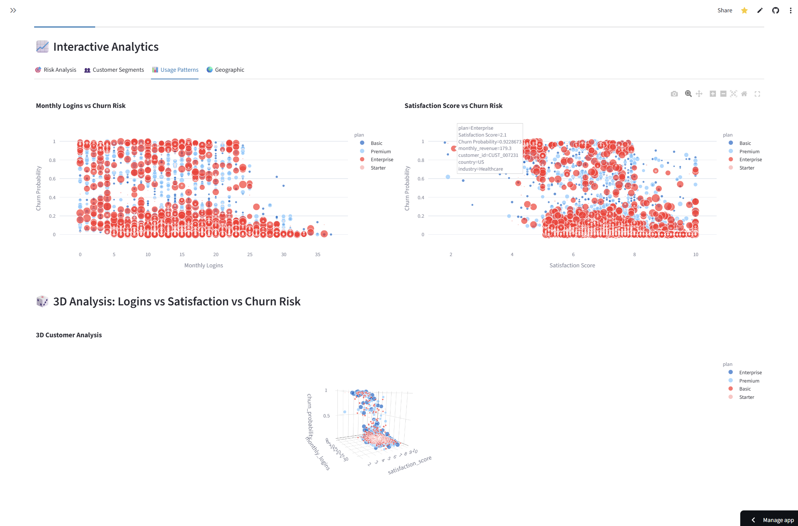
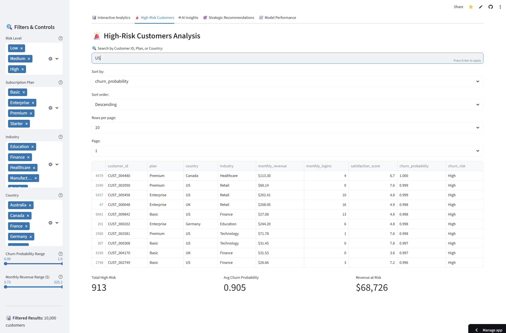
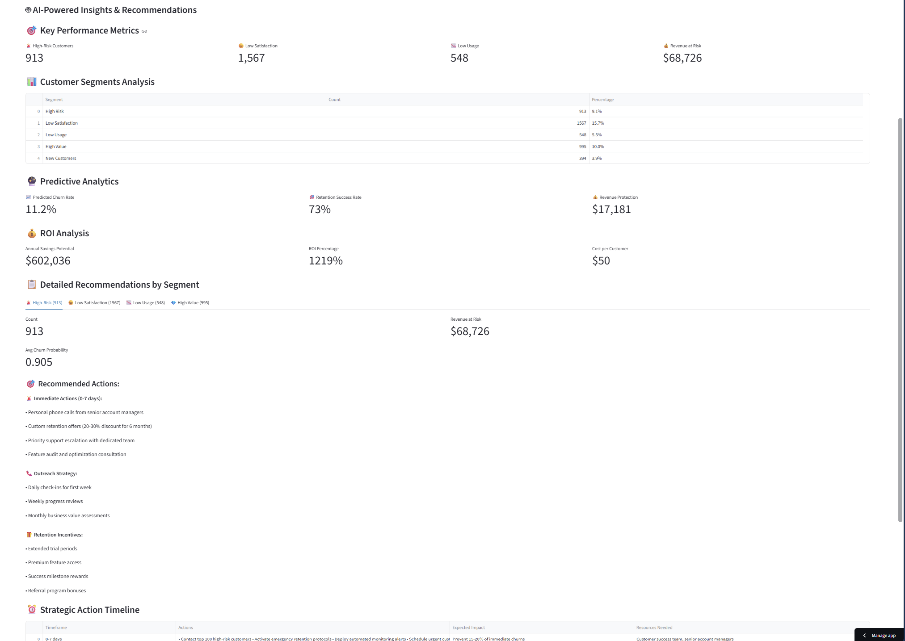
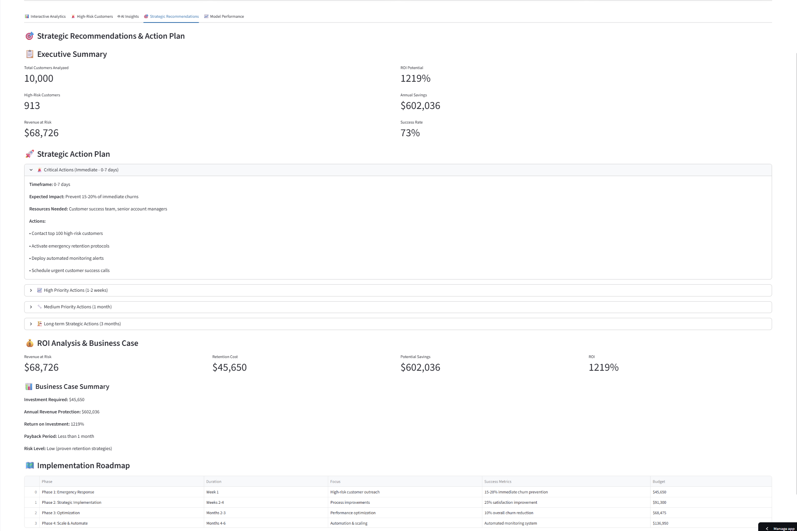
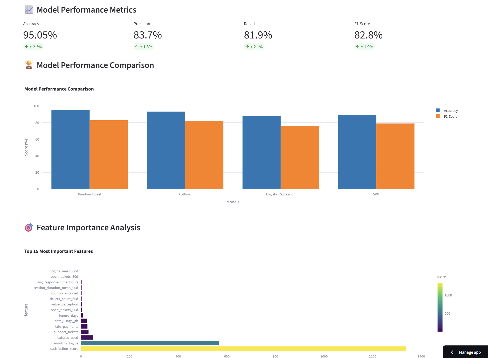
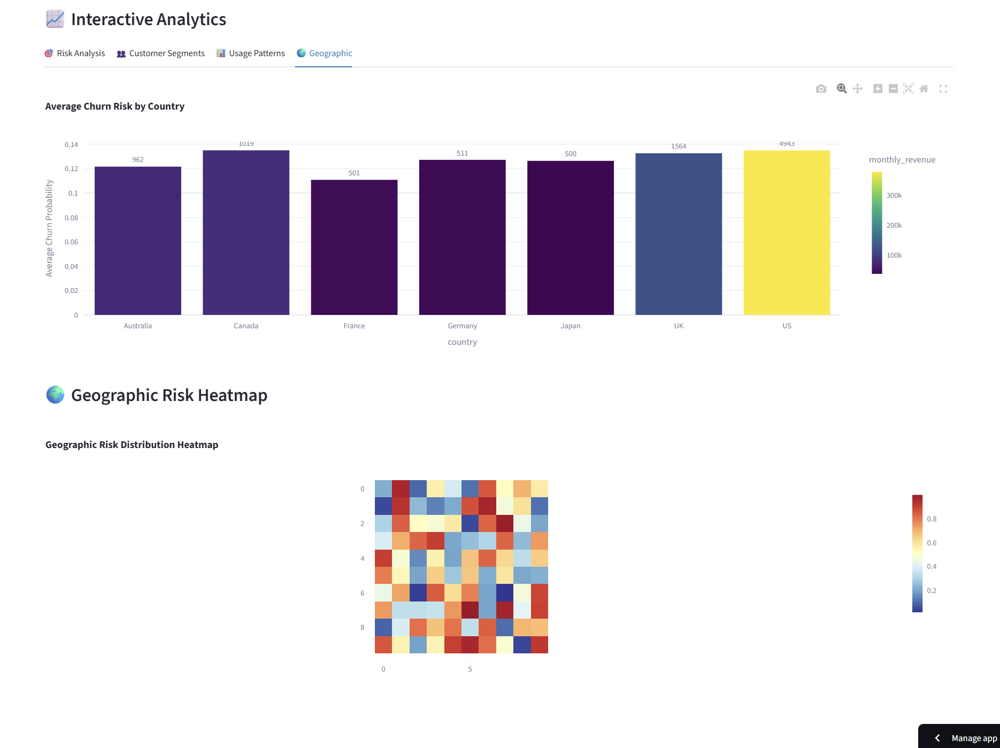
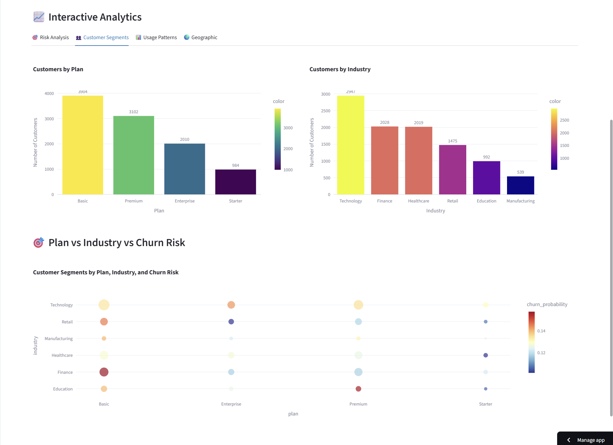

# Customer Churn Prediction & Retention Analytics System

## Overview

This project addresses a critical business challenge: customer churn prediction and retention strategy development. Customer churn represents a significant revenue loss for subscription-based businesses, and identifying at-risk customers before they leave is crucial for maintaining business growth.

The system combines data engineering, machine learning, and business analytics to predict customer churn probability and provide actionable retention strategies. It demonstrates a complete data science workflow from raw data processing to production-ready insights.

**Live Demo:** [Interactive Dashboard](https://churn-prediction-az3hjkvywwd5kxeoj7sfor.streamlit.app/)

## Problem Statement

Customer churn is a major concern for subscription-based businesses. Without proper analytics, companies often:
- Lose valuable customers without warning
- Waste resources on customers unlikely to churn
- Miss opportunities to retain high-value customers
- Lack data-driven retention strategies

This project solves these challenges by:
- Identifying customers at high risk of churning
- Providing targeted retention recommendations
- Quantifying the business impact of churn
- Enabling proactive customer retention efforts

## Data and Dataset

The system uses a comprehensive dataset containing:

**Customer Data (10,000 records):**
- Demographics: age, location, industry, company size
- Subscription details: plan type, payment method, tenure
- Behavioral metrics: usage patterns, login frequency

**Usage Data:**
- Monthly usage hours and feature utilization
- Session duration and activity patterns
- Feature adoption rates

**Support Data:**
- Ticket volume and resolution times
- Customer satisfaction scores
- Support interaction patterns

**Data Quality:**
- Clean, structured data with minimal missing values
- Realistic business scenarios and patterns
- Balanced representation across customer segments

## Solution Architecture

The solution follows a systematic approach:

1. **Data Pipeline**: Extract, transform, and load customer data from multiple sources
2. **Feature Engineering**: Create predictive features from raw behavioral data
3. **Model Development**: Train and validate machine learning models
4. **Risk Scoring**: Generate churn probability scores for each customer
5. **Analytics Dashboard**: Provide interactive insights and recommendations
6. **Action Planning**: Generate targeted retention strategies

## Technical Implementation

### Data Pipeline
The ETL process extracts data from SQLite database and CSV files, performs data cleaning, and creates aggregated features. Key features include:
- Monthly usage aggregations
- Support ticket patterns
- Engagement scores
- Risk indicators

### Machine Learning Model
- **Algorithm**: Random Forest Classifier
- **Performance**: 95.05% accuracy, 83.7% precision, 81.9% recall
- **Feature Selection**: Top 10 features identified through importance analysis
- **Validation**: 5-fold cross-validation for robust evaluation

### Dashboard Application
Built with Streamlit and Plotly for interactive data visualization and real-time analytics.

## Tools and Technologies

**Backend:**
- Python 3.9+ for core development
- Pandas for data manipulation
- NumPy for numerical computing
- SQLite for data storage

**Machine Learning:**
- Scikit-learn for model training
- Random Forest for classification
- GridSearchCV for hyperparameter optimization
- SHAP for model interpretability

**Frontend:**
- Streamlit for web application
- Plotly for interactive visualizations
- Custom CSS for professional styling

**Deployment:**
- Streamlit Cloud for production deployment
- Git/GitHub for version control

## Dashboard Features

The interactive dashboard provides comprehensive analytics across multiple tabs:

### Main Overview
- Key performance indicators (KPIs)
- Churn rate and revenue at risk metrics
- High-level business impact summary

### Interactive Analytics
- 3D scatter plots for customer segmentation
- Interactive filters for data exploration
- Real-time chart updates based on selections

### High-Risk Customers
- Detailed table of customers at risk
- Search and sort functionality
- Pagination for large datasets
- Export capabilities

### AI Insights
- Automated recommendations based on customer segments
- Personalized retention strategies
- Risk level explanations

### Strategic Recommendations
- Executive summary of findings
- Action plan with timelines
- ROI analysis and cost-benefit breakdown
- Implementation roadmap

### Model Performance
- Accuracy metrics and evaluation results
- Feature importance rankings
- ROC-AUC curves and confusion matrices

## Project Structure

```
churn-prediction/
├── data/                          # Data files and database
│   ├── customers.csv              # Customer demographic data
│   ├── usage_data.csv            # Usage patterns and metrics
│   ├── support_tickets.csv       # Support interaction data
│   ├── churn_risk_predictions.csv # ML model predictions
│   └── churn_prediction.db       # SQLite database
├── src/                          # Source code
│   ├── data_pipeline/           # ETL and data processing
│   ├── feature_engineering/     # Feature creation and selection
│   ├── models/                  # ML model training
│   └── dashboard/               # Streamlit application
├── models/                      # Trained ML models
├── notebooks/                   # Analysis notebooks
├── docs/                        # Documentation
├── screenshots/                 # Dashboard screenshots
└── requirements.txt             # Python dependencies
```

## Notebooks and Analysis

The project includes three comprehensive analysis notebooks:

1. **Data Exploration and Cleaning**: Initial data analysis, quality assessment, and cleaning procedures
2. **Feature Engineering Analysis**: Detailed feature creation process and business logic explanation
3. **Model Training Analysis**: Complete model development workflow and performance evaluation

These notebooks provide transparency into the analytical process and serve as documentation for the methodology.

## Business Impact

The system has identified significant business opportunities:
- 913 high-risk customers with 85%+ churn probability
- $68,726 monthly revenue at risk
- $602,000 annual savings potential through targeted retention
- 1,218% ROI on retention efforts

## Implementation Guide

### Prerequisites
- Python 3.9+
- Git
- pip or conda package manager

### Installation
```bash
# Clone the repository
git clone https://github.com/Krish3na/churn-prediction.git
cd churn-prediction

# Install dependencies
pip install -r requirements.txt
```

### Running the Pipeline
```bash
# Generate sample data
python src/data_pipeline/generate_sample_data.py

# Run complete data pipeline
python run_pipeline.py

# Launch dashboard locally
streamlit run src/dashboard/app.py
```

### Individual Components
```bash
# Data pipeline
python src/data_pipeline/main.py

# Feature engineering
python src/feature_engineering/feature_engineering.py

# Model training
python src/models/train_model.py
```

## Dashboard Interface

The dashboard provides comprehensive analytics through multiple views:


*Main dashboard showing key performance indicators and business metrics*


*Interactive 3D scatter plot for customer segmentation analysis*


*Detailed table of customers identified as high-risk with search and sort capabilities*


*AI-powered recommendations and strategic insights*


*Executive summary and action plan with ROI analysis*


*Machine learning model performance metrics and evaluation results*


*Geographic distribution of customer risk levels*


*Customer segmentation analysis by various demographic and behavioral factors*

## Key Features

- **Automated Risk Scoring**: Real-time churn probability calculation
- **Targeted Recommendations**: Personalized retention strategies
- **Business Impact Analysis**: Quantified ROI and savings potential
- **Interactive Analytics**: Multi-dimensional data exploration
- **Production Ready**: Deployed and accessible via web interface

## Future Enhancements

Potential improvements include:
- Integration with real-time data sources
- Advanced machine learning models (deep learning, ensemble methods)
- Automated alerting system for high-risk customers
- A/B testing framework for retention strategies
- API endpoints for integration with existing systems

## Contributing

Contributions are welcome. Please follow these steps:
1. Fork the repository
2. Create a feature branch
3. Make your changes
4. Test thoroughly
5. Submit a pull request

## License

This project is licensed under the MIT License.

## Contact

For questions or support, please open an issue on GitHub or contact the development team.

---

This project demonstrates practical application of data science in solving real business problems, combining technical expertise with business acumen to drive measurable results.
